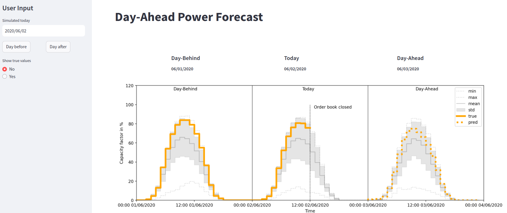

# Day-Ahead Power Forecast app

Global warming and its resulting climate change is re-shaping our society and actions have to be taken to try to minimize the macro effects on our 🌍

The green energy transition and the use of renewable resources, such as ☀️, 🌬️ or others to produce energy will contribute to that
effort.

The energy market will need more tools to predict the production of those intermittent energy source. Unlike coal- or nuclear-based energy production, solar and wind energy is not constant.

## 💲 As a business you need to be able to predict the day ahead energy production of your solarpark market to place selling orders on the energy market 📈

✅ We got you covered with our Day-Ahead Photovoltaic Energy production App!

Check out our [streamlit](https://advanced-power-forecast-photovoltaic.streamlit.app/) App:

#### 🌟 Check out the [slides](https://www.linkedin.com/in/jeromeroeser/overlay/1744377611136/single-media-viewer?type=DOCUMENT&profileId=ACoAAAGjF0wB8w-VCupnS3w9Wf2GK5LWXa8UrsQ&lipi=urn%3Ali%3Apage%3Ad_flagship3_profile_view_base%3BLSHqlHnvRXayjYoq5Pn%2BAw%3D%3D) that describe more in-depth details the real-world problem our app is solving (after a few intro slides about my profile).

# 💻 Project Features & Tech Stack
With this project I have built an ***end-to-end*** solution with ***industry standard tools***. 
#### The project features an end-to-end pipeline that includes:

* Data collection and storage
* Data cleaning and preprocessing
* Feature engineering
* Model training and evaluation
* Model deployment as a Web App

#### 🔧 Tools used within the project

* ***Cloud Platform***: `GCP`
  - Storage & querying of data from BigQuery
  - Persisting models in buckets
  - Google Artifact Registry to store Docker images
  - Cloud Run to serve the Docker image and deploy the API
* ***Workflow*** orchestrated with `Prefect`
* API with `FastAPI`
* ***Containerization*** with `Docker`
* ***Version control*** with proper `Git` workflow
* Industry-standard ***ML Framework*** with `Pytorch` ([first version](https://github.com/jerome-roeser/advanced-power-forecast) was developed with `TensorFlow`)
* ***Experiment Tracking*** tool: `MLflow`
* ***WebApp*** with `streamlit`

 
 
 
 

✅ *Prefect workflow:*
--

